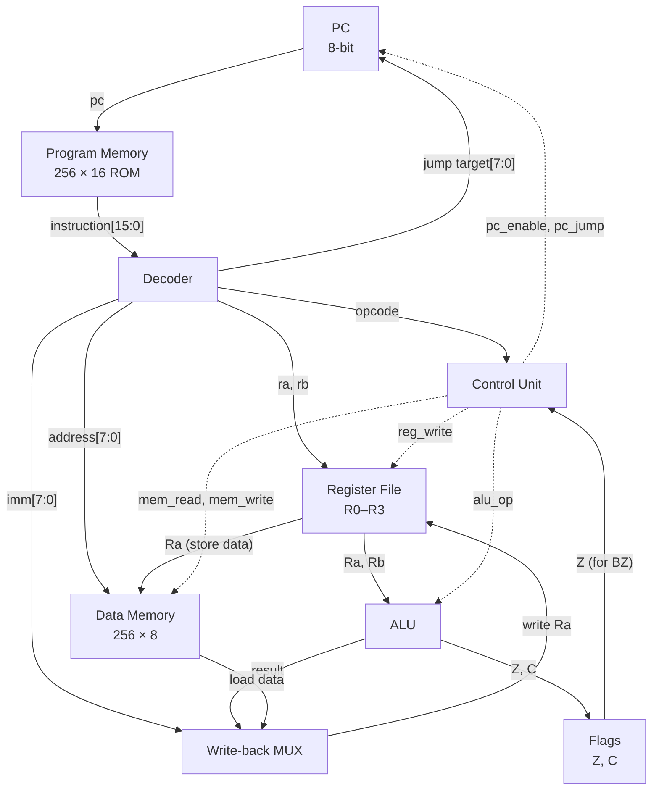
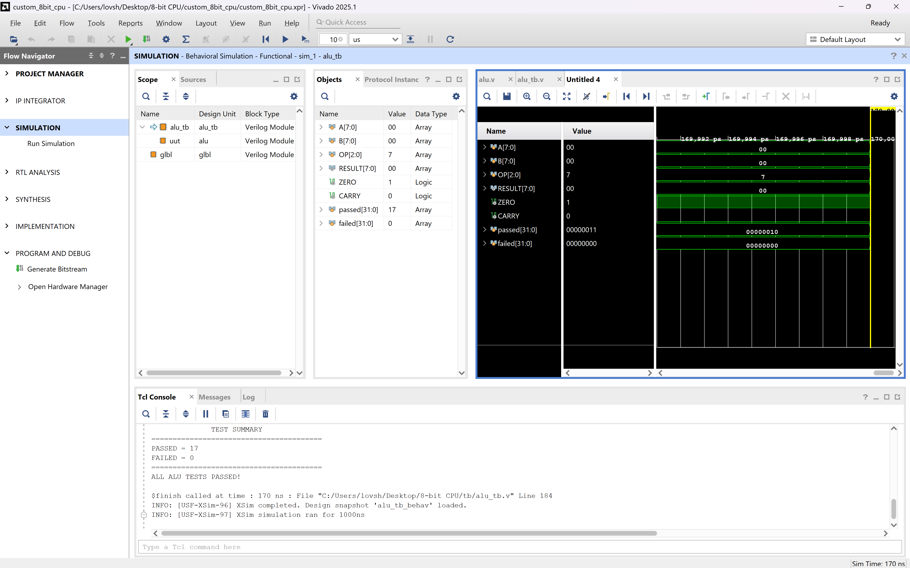
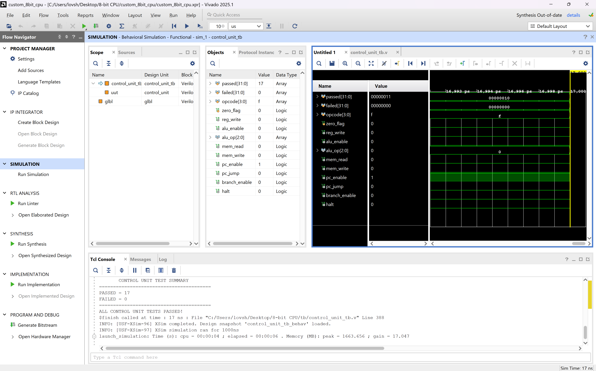

<div align="center">

# R8-Core

**A custom 8-bit CPU designed and verified in Verilog.**


</div>

R8-Core is a single-cycle, Harvard-architecture 8-bit processor, written from scratch in Verilog.
- It executes a custom 16-bit instruction set (ISA v1.0, 14 instructions) with four general-purpose registers, a 256-word program ROM and a 256-byte data memory.
- Every module and the integrated CPU are covered by self-checking testbenches that pass in two independent simulators.
- The design has completed a real Vivado synthesis run.

FPGA implementation on the target board has not started yet (see [Status](#status-and-roadmap)).

---

## Architecture at a Glance

| | |
| :--- | :--- |
| **Data width** | 8 bits |
| **Instruction width** | 16 bits, fixed length (R, I, J formats) |
| **Registers** | 4 × 8-bit general purpose (`R0`–`R3`) |
| **Program counter** | 8 bits |
| **Program memory** | 256 × 16-bit ROM (combinational read, optional `$readmemh` image) |
| **Data memory** | 256 × 8-bit (synchronous write, combinational read) |
| **Flags** | `Z` (zero), `C` (carry / no-borrow) |
| **Execution** | Single-cycle: one instruction per clock, synchronous active-high reset |
| **ISA** | ISA v1.0 (locked), 14 defined instructions |
| **HDL** | Verilog |
| **Simulation** | Icarus Verilog and Vivado XSim |
| **Synthesis** | AMD Vivado 2025.1 |

---

## CPU Architecture



Solid lines are data paths and dashed lines are control signals. The flag-update enables and the write-back select are decoded from the opcode inside `cpu.v`. All state (PC, registers, flags, data memory) updates on the same rising clock edge.

Details: [`docs/ARCHITECTURE.md`](docs/ARCHITECTURE.md).

---

## Instruction Set (ISA v1.0)

| Category | Instruction | Opcode | Operation | Flags |
| :--- | :--- | :---: | :--- | :---: |
| **Arithmetic** | `ADD Ra, Rb` | `0001` | `Ra ← Ra + Rb` | Z, C |
| | `SUB Ra, Rb` | `0010` | `Ra ← Ra − Rb` | Z, C |
| | `INC Ra` | `0110` | `Ra ← Ra + 1` | Z, C |
| | `DEC Ra` | `0111` | `Ra ← Ra − 1` | Z, C |
| **Logical** | `AND Ra, Rb` | `0011` | `Ra ← Ra & Rb` | Z |
| | `OR Ra, Rb` | `0100` | `Ra ← Ra \| Rb` | Z |
| | `XOR Ra, Rb` | `0101` | `Ra ← Ra ^ Rb` | Z |
| **Data movement** | `LOADI Ra, imm` | `1000` | `Ra ← imm[7:0]` | – |
| | `LOAD Ra, addr` | `1001` | `Ra ← DataMemory[addr]` | – |
| | `STORE Ra, addr` | `1010` | `DataMemory[addr] ← Ra` | – |
| **Control flow** | `JMP addr` | `1011` | `PC ← addr` | – |
| | `BZ addr` | `1100` | `if Z: PC ← addr` | – |
| **System** | `NOP` | `0000` | No operation | – |
| | `HALT` | `1101` | Hold PC until reset | – |

- Opcodes `1110` and `1111` are reserved and execute as NOP.
- For SUB and DEC, `C = 1` means **no borrow** (ARM-style).

Full encoding: [`docs/ISA.md`](docs/ISA.md).

---

## Verification

<div align="center">

### 278 / 278 checks passed · 0 failures

**18 self-checking testbenches · Icarus Verilog and Vivado XSim · strict `xvlog`: 0 errors, 0 warnings**

</div>

| Level | What is tested | Testbenches | Checks |
| :--- | :--- | :---: | :---: |
| **Unit** | ALU, register file, PC, decoder, control unit, program memory, data memory, flags | 8 | 90 |
| **CPU programs** | Basic execution, LOAD/STORE memory\*, BZ branching\*, loops\*, ISA v1.0 regression | 5 | 98 |
| **CPU boundaries** | Arithmetic overflow/borrow, INC/DEC wrap, memory `0x00`/`0xFF`, PC wrap and jump limits | 4 | 49 |
| **FPGA wrapper** | `cpu_fpga_top` running `mem/program.mem` with no preload, checked through its ports only (36-step trace) | 1 | 41 |
| **Total** | Both simulators give identical results | **18** | **278** |

\* The Memory, Branching and Loop suites were reconstructed from the current RTL, because their original source files were lost. Mutation runs confirmed that they detect errors.

These are **simulation** results. R8-Core hasn't run on FPGA hardware yet.

<table>
<tr>
<td align="center"><br><sub>ALU unit test in Vivado XSim: <code>PASSED = 17, FAILED = 0</code></sub></td>
<td align="center"><br><sub>Control-unit unit test in Vivado XSim: <code>PASSED = 17, FAILED = 0</code></sub></td>
</tr>
</table>

Full report: [`docs/VERIFICATION.md`](docs/VERIFICATION.md).

---

## Synthesis

Vivado 2025.1, top `cpu_fpga_top`, part `xczu7ev-ffvc1156-2-e`, synthesis only.

| Resource | Used |
| :--- | ---: |
| CLB LUTs | 519 |
| Flip-flops | 1,066 |
| Block RAM | 0 |
| URAM | 0 |
| DSP | 0 |
| CARRY8 | 1 |

0 errors, 0 critical warnings, 1 warning (`Synth 8-7080`, a parallel-synthesis flow message).

> **Caveat: these numbers are program-specific.** `mem/program.mem` is loaded into the ROM at synthesis time, so Vivado optimizes the hardware for that exact program:
> - The ROM became a 32 × 15 LUT ROM.
> - Data memory became flip-flop storage, and only the 128 addresses the program can reach were kept.
>
> The 519 LUT / 1,066 FF result is therefore **not** a generic area figure for the CPU.

No clock constraint exists yet, so there is **no timing or maximum-frequency result**. The `xczu7ev` part was used for synthesis only; the laboratory target is the **AUP-ZU3**.

---

## Repository Structure

```text
R8-Core/
├── rtl/                  Verilog RTL: 9 CPU modules + cpu_fpga_top.v wrapper
├── tb/                   18 self-checking testbenches
├── mem/
│   └── program.mem       28-word ISA coverage program loaded by cpu_fpga_top
├── docs/
│   ├── ISA.md            Instruction set specification (v1.0, locked)
│   ├── ARCHITECTURE.md   Datapath, modules, timing and reset behavior
│   ├── VERIFICATION.md   Test plan, results and evidence
│   ├── DEVELOPMENT_LOG.md  Milestone history
│   └── verification/     Vivado XSim screenshots of unit tests
├── custom_8bit_cpu/      Vivado 2025.1 project (custom_8bit_cpu.xpr)
└── sim/                  Output directory for local Icarus builds (contents not tracked)
```

---

## Running the Simulations

Icarus Verilog, one unit test:

```bash
iverilog -g2012 -o sim/alu_tb.vvp rtl/alu.v tb/alu_tb.v
vvp sim/alu_tb.vvp
```

A CPU-level test. `-s` selects the testbench as the only top, because `rtl/*.v` also contains the wrapper:

```bash
iverilog -g2012 -s cpu_isa_regression_tb -o sim/cpu_isa_regression_tb.vvp rtl/*.v tb/cpu_isa_regression_tb.v
vvp sim/cpu_isa_regression_tb.vvp
```

The FPGA wrapper test. `program.mem` is opened relative to the working directory:

```bash
iverilog -g2012 -s cpu_fpga_top_tb -o sim/cpu_fpga_top_tb.vvp rtl/*.v tb/cpu_fpga_top_tb.v
cd mem && vvp ../sim/cpu_fpga_top_tb.vvp
```

**Vivado:** open `custom_8bit_cpu/custom_8bit_cpu.xpr`.
- The design top is `cpu_fpga_top`.
- The simulation top is `cpu_control_flow_boundary_tb`; change it to run another suite.
- `alu_tb`, `register_file_tb` and `cpu_fpga_top_tb` aren't in the project's simulation set. Run them standalone.

---

## Status and Roadmap

**Completed: design, verification and synthesis**

- [x] CPU architecture
- [x] ISA v1.0
- [x] RTL implementation
- [x] Unit verification
- [x] CPU verification
- [x] Full regression (278/278, Icarus and XSim)
- [x] Synthesis (Vivado)
- [x] Documentation
- [x] GitHub repository

**Remaining: FPGA bring-up on the AUP-ZU3**

- [ ] AUP-ZU3 board-specific constraints (clock, pins, I/O standards)
- [ ] FPGA implementation / place and route
- [ ] Timing analysis
- [ ] Bitstream generation
- [ ] Physical FPGA validation

---

## Limitations

- **Board I/O not yet added.** `cpu_fpga_top` passes `clk` and `reset` straight through. Clock buffering, reset synchronization and board I/O mapping come with the AUP-ZU3 work.
- **Register-based data memory.** Data memory resets `memory[0:7]` (documented behavior), so it maps to flip-flops, not RAM primitives.
- **Unwritten memory differs.** Locations that were never written are `X` in simulation and `0` on hardware.
- **Timescale warnings.** RTL files have no `` `timescale ``, so XSim reports 18 cosmetic `XSIM 43-4099` warnings per elaboration.

---

## Documentation

| Document | Contents |
| :--- | :--- |
| [ISA](docs/ISA.md) | Formats, opcode map, flag rules, encoding examples |
| [Architecture](docs/ARCHITECTURE.md) | Datapath, module interfaces, control table, clock/reset, synthesis mapping |
| [Verification](docs/VERIFICATION.md) | Per-testbench results, reconstructed suites, mutation evidence, synthesis evidence |
| [Development Log](docs/DEVELOPMENT_LOG.md) | Chronological milestones and corrections |

## Tools

Verilog · Icarus Verilog · AMD Vivado 2025.1 (XSim, `xvlog`, synthesis) · Git / GitHub

---

<div align="center">
<sub>R8-Core: designed from RTL up, verified before hardware.</sub>
</div>
